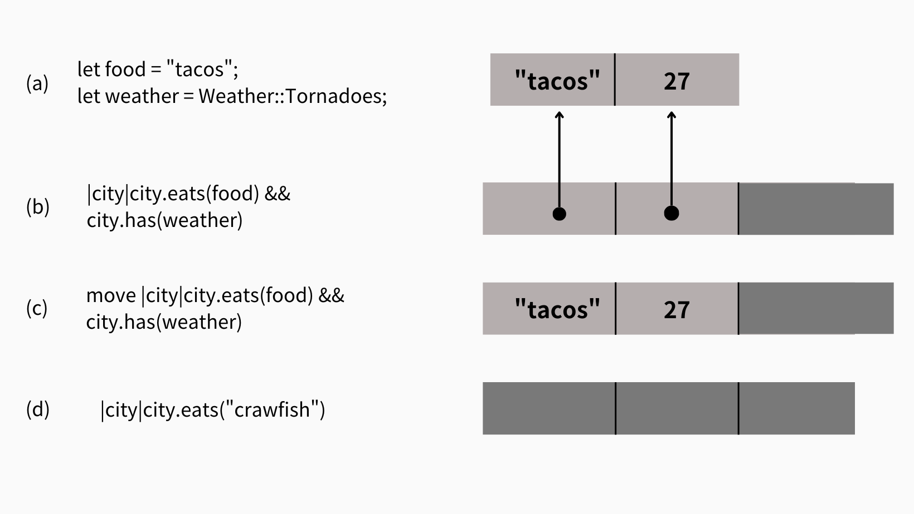
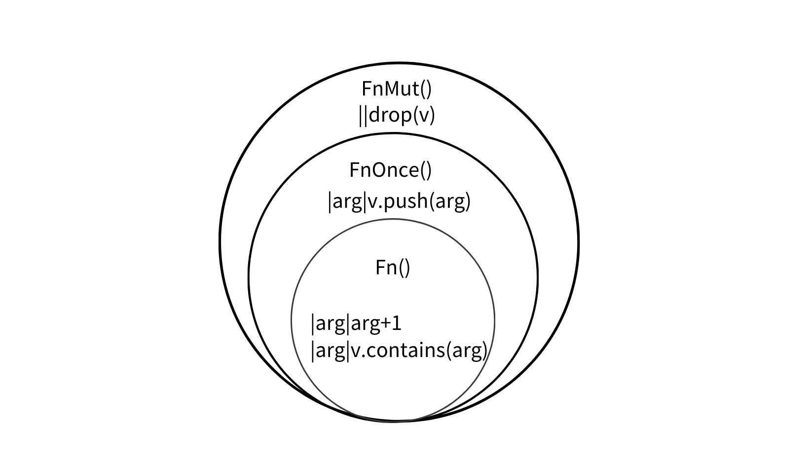

# Day11-closure


排序整數向量十分容易：


```rust
integers.sort();
```


但並非所有需要排序的資料都是向量，例如結構，你就無法使用sort方法，你可能需要指定方法


```rust
// 依人口數遞減排列
struct City {
  name: String,
  population: i64,
  country: String,
  ...
}

fn city_population_descending(cities: &mut Vec<City>) {
  cities.sort_by_key(city_population_descending);
}

fn sort_cities(cities: &mut Vec<City>) {
  cites.sort_by_key(city_population_descending);
}
```

`sort_by_key`會把參數`cites`丟給函式，在收集函式吐出來的資料做排序，這個key指的是sort接受key函式。

因此你可以用更簡潔的方式處裡，**匿名函式closure**


```rust
fn sort_cities(cities: &mut Vec<City>){
  cites.sort_by_key(|citiy| -city.population)
}
```


closure的引數是city，回傳-city.population，系統會根據使用的方法來推斷引數的型態以及回傳型態

## 抓變數

closure可以使用包著它的函式的參數，例如下例，這個closure的使用stat，可以視為「捕捉capture到stat，但基於對生命週期的掌控，沒有垃圾回收的Rust使用closure抓變數使有限制的。


```rust
fn sort_cities(cities: &mut Vec<City>, stat: Statistic){
  cites.sort_by_key(|citiy| -city.get_statistic(stat));
}
```

### 借用的closure

回顧上例，一般的closure使用參數時，會自動借用參考，並且這個行為符合過去所說的生命規則，closure使用stat參考，不能超過stat的生命週期。而此例closure在排序後消滅，沒有問題。

這樣的做法既確保安全性，並且比垃圾回收的速度快，等等會詳細說明。

### 盜用的closure


```rust
use std::thread;

fn start_sorting_thread(mut cities: Vec<City>, stat: Statistic) 
-> thread::JoinHandle<Vec<City>>
{
    let key_fn = |city &City| -> i64 { -city.get_statistic(stat)};
    
    thread::spawn(|| {
      cities.sort_by_key(key_fn);
      cities
    })
    
    
}
```


thread::swpan會開啟新的執行緒，完全獨立於主要的執行緒，它接受一個closure。

因此在這段程式中，有一些新的生命週期問題

closure_fn會借用stat的參考，但新執行緒有自己的生命週期，即使仍在同一個函式中，無法確認stat的生命週期有超過。換句話說，當stat的參考被放入key_fn，再放入行執行緒中，無法判斷新執行緒與`start_sorting_thread`的執行(此函式執行結束stat會被耗用)哪個先結束。

同樣的，我們也無法確認cities有被安全的共享，因此，我們應該是要將兩者**盜用steal**，而不是借用參考：


```rust
fn start_sorting_thread(mut cities: Vec<City>, stat: Statistic) 
-> thread::JoinHandle<Vec<City>>
{
    let key_fn = move |city &City| -> i64 { -city.get_statistic(stat)};
    
    thread::spawn(move || {
      cities.sort_by_key(key_fn);
      cities
    })
    
    
}
```

我們要告訴Rust我們要移入stat與cities，只要在前面加上`move`關鍵字。

第一個key_fn我們要取得stat的所有權，第二個thread::spwan我們要key_fn與cities的所有權。

## closure性能

Rust的closure最大優點就是一個字：快

多數程式語言會將closure放置在heap中，並且以函式般動態指派與垃圾回收處理，進而導致佔用cpu的時間在建立、呼叫與收集。

而Rust，第一不需要垃圾回收，第二它不會被配置在heap中，除非你將他們放在Box、Vec或其他容器中。第三因為每個closure都"有特定的型態，因此可以藉由內連技術(讓closure直接插入調用點而不是動態呼叫)，讓你在緊密的回圈中也可以使用closure。



(a)案例中，我們用closure找出既有taco又有tornado的程式，在記憶體內，就像一個小型結構，有它使用的變數參考

注意，裡面沒有指向它的程式碼的指標，而是以型態來判斷呼叫的程式

(b)同上例，只是以move來容納值，而不是參考。

(c)不使用任何周遭環境變數，closure不佔用任何記憶體

closure除了使用的參考或值之外，不會佔用記憶體，且加上內連的技術，連這張圖的簡的結構也可以優化。


## Closure安全性

雖然預設的情況是借用參考，但有些狀況下，closure會根據你所使用的方式決定是否移動該值，也就是即使不使用move，仍有可能封包行為必須獲取參數的所有權

回歸到本質，會有獲取參考、所有權與可變參考，以trait的角度看：


```rust
trait Fn() -> R {
  fn call(&self) -> R;
}

trait FnMut() -> R {
  fn call_mut(&mut self) -> R;
}

trait FnOnce -> R {
  fn call_once(self) -> R;
}
```

### FnOnce

FnOnce的概念是，因為耗用所有權，所以他們不能使用第二次


```rust
let dict = produce_glossary();
let debug_dump_dict = || {
  for (key, value) in dict {
    println!("{:?} - {:?}, key , value");
  }
};

debug_dump_dict()
debug_dump_dict() //dict會被耗用
```

1. dict 的所有權：當你在閉包中使用 dict 時，閉包試圖將 dict 的所有權轉移到閉包內部。這是因為你在閉包內部的 for 迴圈嘗試使用 dict，這種情況下 Rust 必須捕獲 dict 的所有權，因為它需要在閉包的執行過程中擁有 dict。

2. 無法重複使用：由於閉包捕獲了 dict 的所有權，dict 在第一次執行閉包時會被移動，這導致 dict 在閉包第一次調用後就不再有效。因此，你不能再次調用閉包，因為 dict 已經被移動了。

要修正這樣的bug，就是使`debug_dump_dict()`變成Fn()，捕獲參考


```rust
let dict = produce_glossary();
let debug_dump_dict = || {
    for (key, value) in &dict {  // 捕獲 dict 的不可變引用
        println!("{:?} - {:?}", key, value);
    }
};
```


### FnMut

共用包含mut資料的非mut closure是不安全的，因為讓多個執行緒同時呼叫時會有資料爭用的問題，尤其是同時對同一筆資料讀取和寫入時。

因此，Rust的第三種closure是FnMut，又稱寫入closure，需要以mut的方式操作值(如寫入、修改)都會自動被判定為`FnMut`


```rust
let mut i = 0;
let incr = || {
  i += 1;
  println!("Ding i is now", i);
}
```

如果是有參數的閉包，你必須手動在前面加上`mut`：


```rust
let i_plus_x = |x| { i += x;};// 錯誤

let mut i_plus_x = |x| { i += x;}; //正確

i_plus_x(0);
```

### 關係

如果我們想將寫一個函式來重覆使用兩次closure：


```rust
fn call_twice<F>(closure: F) where F: Fn() {
  closure();
  closure();
};
```

它絕對不能放入FnOnce，因為FnOnce必定會卸除原本參數的值，那如果是放入FnMut呢？


```rust

let mut i = 1;

let i_plus_one = || { i += 1;};

call_twice(i_plus_one);// 錯誤！
```


重新檢視一下call_twice，它的參數是`where F: Fn()`，我們所提供的事FnMut，因此有告訴call_twice我們要給的是`FnMut`!


```rust
fn call_twice<F>(mut closure: F) where F: FnMut() {
  closure();
  closure();
};

let mut i = 1;

let i_plus_one = || { i += 1;};

call_twice(i_plus_one);
rprintln!("i = {}", 1);
#> i = 1
```

總結來說，closure類型分三種，並且三個是由於對閉包值處理性質不同，而有嚴格成度不一的結構：



### closure的Copy與Clone

Rust將closure視為一種結構，裡面有它捕捉的值(對move)或值的參考(非move)。

因此，它遵從一般結構的概念，以它內部行為來決定型態是Copy或Clone。不改變變數，僅保存共想參考的，因為共享參考既是Copy也是Clone，那個CLosure也是如此。


```rust

let mut y = 10;
let add_y = |x|y+x; //僅借用y的參考與x的Copy
let copy_of_add_y = add_y; // 因此add_y也是Copy
rprintln!("{}",add_y(copy_of_add_y(22))); // add_y不會被耗用

#> 42
#> NULL
```
相反，可變參考既不是Copy，也不是Clone，使用它的closure也不是。


```rust
let mut i = 0;
let mut i_add_x = |x| i +=x; //要改變i的值，因此是FnMut
let copy_of_i_add_x = i_add_x; // i_add_x會移入，進而變成未宣告
rprintln!("{}",i_add_x(copy_of_i_add_x(1))); // 錯誤，i_add_x被移動
```

對於move closure，決定於move的值是哪種：


```rust
let mut greeting = String::from("Hello, ");
let greet = move |name| {
  greeting.push_str(name);
  rprintln!("{}", greeting);
};

greet.clone()("Alan");
greet.clone()("Blan");
#> Hello, Alan
#> Hello, Blan
```

`clone()(...)`看起來是很奇怪的語法，它其實只是代表我們複製closure，然後呼叫clone。在greet這個closure中，它內部有greeting的所有權。

當你複製他們時，裡面的greeting也會被複製1份，因此每個函式的greeting都是自己擁有的。

## 回呼

許多程式庫的API都使用回呼，呼回是由用戶提供函式，讓程式褲呼叫。


```rust
async fn get_index() -> HttpResponse {
    HttpResponse::Ok()
        .content_type("text/html")
        .body(
            "<meta charset="UTF-8">
             <title>猜猜數字</title>...",)
}


App::new()
    .route("/", web::get().to(get_index))
    .route("/gcd", web::post().to(post_gcd))
    
```

路由器的概念是將網際網路傳來的請求傳給處理請求的Rust程式碼，在這個例子中，網際網路傳來`/get`請求時，傳遞給post_gcd處理，因此可以換成交由一個closur處理。


```rust
App::new()
    .route("/", web::get().to(||{
      HttpResponse::Ok()
          .content_type("text/html")
          .body("<title>GCD Caculator</title>...")
    }))
    .route("/gcd", web::post().to(|form: web::Form<GcdParameters>|{
      HttpResponse::Ok()
        .content_type("text/html")
        .body(format!("The Gcd of {} and {} is {}.",
                      form.n, form.m, gcd(form.n, form.m)))
    }))

```


這是因為actix-web接受任何執行緒安全的Fn引數。

要如何在自己的程式這樣做？我們試著從零開始寫一個簡單的路由器，我們先宣告一些代表HTTP請求與回應的型態：


```rust
struct Request {
  method: String,
  url: String,
  headers: HashMap<String, String>,
  body: Vec<u8>
}

struct Response {
  code: u32,
  headers: HashMap<String, String>,
  body: Vec<u8>
}
```

目前，路由器的工作只是儲存一個將URL對映到回呼的表，按需求回應到正確的回呼


```rust
struct BasicRouter<C> where C: Fn(&Request) -> Response {
  routes: HashMap<String, C>
}

impl<C> BasicRouter<C> Where C: Fn(&Request) -> Response {
  /// 建立空白路由器
  fn new() -> BasicRouter<C> {
    BasicRouter { routes: Hashmap::new() }
  }
  
  fn add_route(&mut self, url: &str, callback: C) {
    self.routes().insert(url.to_string(), callback);
  }
}
```


但這樣做犯了致命的錯誤，我們宣告每一個BasicRouter都有一個回呼形態C，而所有HshMap都要是相同型態的回呼，這導致當你處理第二條路徑時，編譯器告訴你傳入的closure與預期的不同型態。


```rust
let mut router = BasicRouter::new();
router.add_route("/", |_| get_form_response()); //編譯正確
router.add_route("/gcd", |req| get_gcd_response(req)); //錯誤
```

我們想要支援各種型態，替代的方案是使用box與trait物件


```rust
type BoxedCallback = Box<dyn Fn(&Request) -> Response>;

struct BasicRouter {
  routes: HashMap<String, BoxedCallback>
}
```

每一個box都可以容納不同型態的closure，所以一個HashMap可以容納各種回呼


```rsut
impl BasicRouter {
  fn new() -> BasicRouter {
      BasicRouter { routes: HashMap::new() }
  }
  
  fn add_route<C>(&mut self, url: &str, callback: C)
    where C: Fn(&Request) -> Response + 'static
    {
      self.routes.insert(url.to_string(), Box::new(callback));
    }
}
```

在add_route的簽章中，C有兩個bound：有一個Fn trait，以及一個'static生命期。如果沒有static生命期，呼叫Box:new(callbak)會是一個錯誤，因為當closure所借用的變數參考離開作用域，那麼整個closue將不再安全。


接下來這個路由器就可以處理傳來的請求：


```rust
impl BasicRouter {
  fn handle_request(&self, request: &Request) -> Response {
    match self.routes.get(&request,url) {
      None => not_found_response(),
      Some(callback) => callback(request)
    }
  }
}
```


如果要寫一個更節省空間但彈性較小的程式，試著用**指標函式**取代儲存trait物件，這些型態與closure的作用很像。


```rust
fn add_ten(x: u32) -> u32 {
  x + 10
}

let fn_ptr: fn(u32) -> u32 = add_ten;
let eleven = fn_ptr(1);
rprintln!("{}", eleven);
#> 11
```


函式指標的適用與不捕捉任何東西的closure完全相同，都不需要保存被捕捉變數的任何資訊。如果你適當使用，無論在binding或是函式簽章中，都可以讓程式簡潔。

以下是以函式指標的路由表：


```rust
strut FnPoniterRouter {
  routes: HashMap<String, fn(&Request) -> Response>
}

impl FnPoniterRouter {
  fn new() -> FnPoniterRouter {
    FnPointerRouter { routes: HashMap::new() }
  }
  
  fn add_route(&mut self, url: &str, callback:fn(&Request) -> Response)
  {
    self.routes.insert(url.to_string, callback);
  }
}
```


看起來簡潔多了，沒有Box，也沒有動態配置，只有HashMap本身。

這側面展示的訊息是，Closure本身就是一個獨特的型態，基於它所捕捉的變數不同，因此也需要較複雜的更動。或是在情況許可下，犧牲彈性，寫出如上面例子般，接收函式指標與不抓東西的closure。


